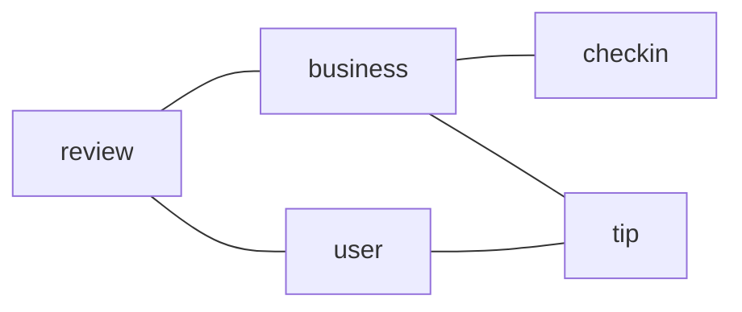

# Descripción del dataset: Yelp Dataset
[Yelp Dataset](https://www.yelp.com/dataset)

Estos datos se recopilan de la plataforma Yelp, un sitio web especializado en reseñas de negocios. El objetivo de este dataset, proporcionado por Yelp, es facilitar la práctica con bases de datos. Consta de 5 tablas: Business (Negocios), Checkin (Registro de visitas), Review (Reseñas), Tip (Consejos) y User (Usuarios).

Estas tablas contienen información relevante, como el nombre, la dirección y la categoría de cada negocio, así como datos detallados sobre las reseñas de los usuarios, incluyendo la puntuación y el texto de las mismas. 

---
Esquema Yelp Dataset
---

## Posibles relaciones
- Relación entre Business y Review: Cada reseña de Review está asociada a un negocio específico en la tabla de Business.
- Relación entre User y Review: Cada reseña en el conjunto de datos de Review está escrita por un usuario específico en el conjunto de datos de User.

# Investigacion SGBD: PostgreSQL
PostgreSQL es una base de datos relacional de código abierto que se originó en la Universidad de California en Berkeley en la década de 1980. 
Originalmente conocida como POSTGRES. En 1996 fue renombrada a PostgreSQL para reflejar su soporte de SQL. Es compatible con la mayoría de los sistemas operativos, incluyendo Linux, macOS y Windows.

PostgreSQL ofrece funciones para ayudar a los desarrolladores y administradores de bases de datos a crear aplicaciones, proteger la integridad de los datos y administrar conjuntos de datos grandes y pequeños. Es conocido por su arquitectura, seguridad, escabilidad y estabilidad, además de su capacidad para manejar cargas de trabajo complejas. 

PostgreSQL es conocido por ser un SGBD extremadamente potente y escalable. Es capaz de manejar grandes conjuntos de datos y soporta características avanzadas de SQL, como subconsultas anidadas, tipos de datos personalizados, vistas materializadas y más. También es un SGBD orientado a objetos y ofrece soporte para funciones y procedimientos almacenados en diferentes lenguajes de programación, como PL/SQL, PL/Python y PL/Perl. En términos de seguridad, PostgreSQL es conocido por ser uno de los SGBD más seguros disponibles en el mercado. Ofrece características avanzadas de seguridad, como autenticación de dos factores, encriptación de datos en reposo y encriptación de conexiones SSL/TLS. 

Entre las características que lo diferencian de otros sistemas de gestión de bases de datos se encuentran la capacidad de trabajar fácilmente con los resultados de las operaciones INSERT, UPDATE y DELETE utilizando Common Table Expressions (CTEs), la amplia variedad de tipos de datos y funciones útiles para aplicaciones que trabajan con datos complejos, como tipos de rangos, arreglos, jsonb (9.4), hstore, funciones de expresiones regulares, entre otros, y la capacidad de almacenar y buscar coordenadas geográficas de latitud y longitud.

Referencias: 

[Wikipedia. (2023, May 6). PostgreSQL. In Wikipedia. Retrieved May 7, 2023](https://en.wikipedia.org/wiki/PostgreSQL)

[PostgreSQL Global Development Group. (n.d.). About PostgreSQL](https://www.postgresql.org/about/)

[Reddit. (2014, July 17). Why use PostgreSQL? [Online forum post]](https://www.reddit.com/r/PostgreSQL/comments/2ayilx/why_use_postgresql/)

[Reddit. (2012, July 28). Convince me to choose PostgreSQL over MySQL. [Online forum post]](https://www.reddit.com/r/PostgreSQL/comments/xblooo/convince_me_to_choose_postgresql_over_mysql/)

