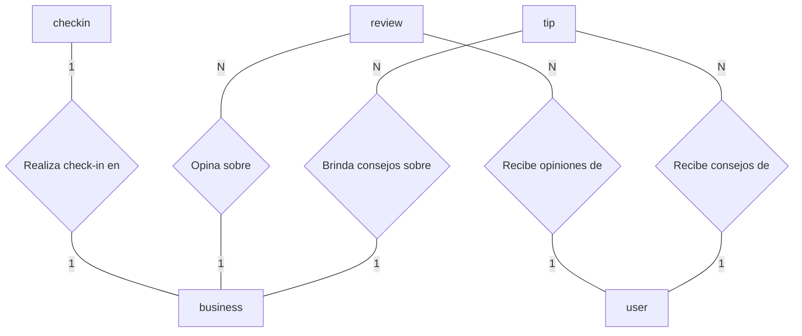
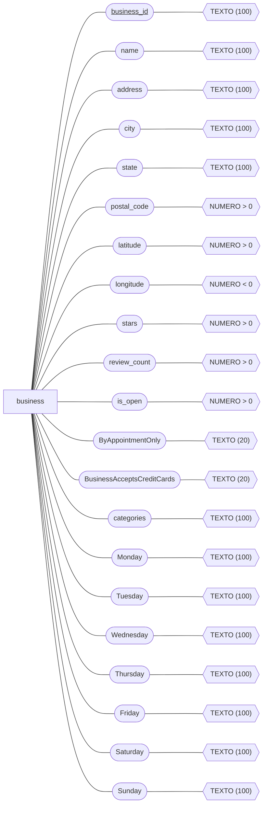
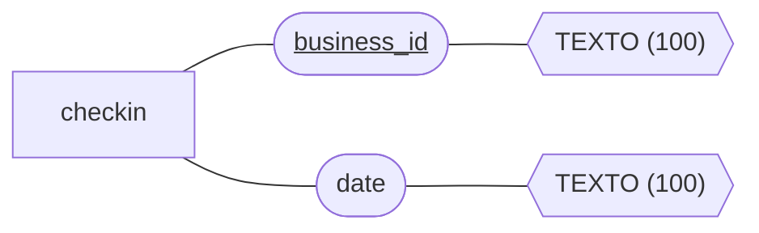
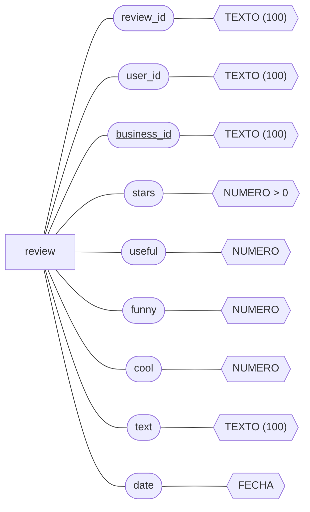
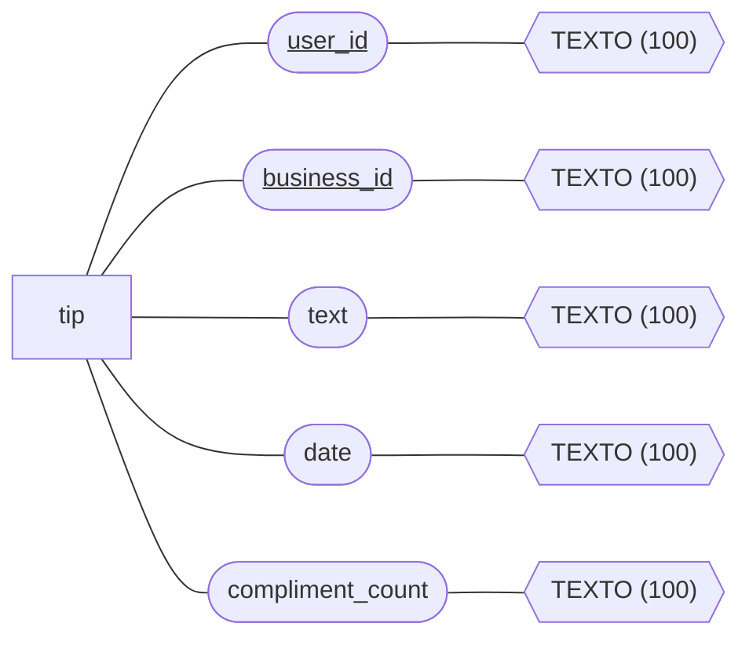
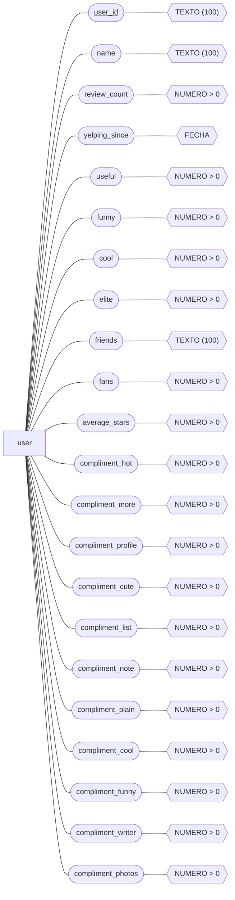

# Tarea: Convierte tu base de datos no estructurada en un modelo entidad-relación

# Diagrama entidad-relación

## Nivel 1: Relaciones entre las entidades
A continuación se presenta el diagrama entidad-relación en el nivel 1, donde se muestran las relaciones entre las entidades:

## Nivel 2: Entidades y sus atributos
A continuación se presenta el diagrama entidad-relación en el nivel 2, donde se detallan las entidades y sus atributos:

### Entidad 1: Business

### Entidad 2: Checkin

### Entidad 3: Review

### Entidad 4: Tip

### Entidad 5: User
