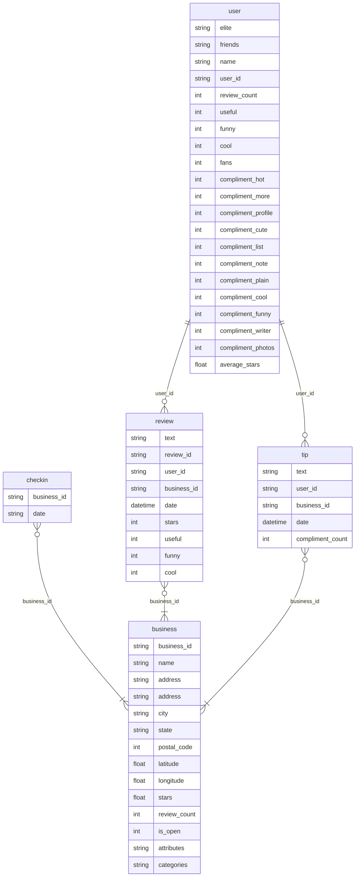

## Crea un esquema del modelo relacional de tu base de datos a partir del modelo E-R de la tarea anterior.
>Business(<u>business_id</u>,postal_code,name,city,categories,state,hours,attributes,address,review_count,is_open,latitude,longitude,stars)
>Checkin(date,<u>business_id</u>)
>Review(<u>review_id</u>,text,date,stars,useful,funny,cool,<u>business_id</u>,<u>user_id</u>)
>Tip(text,date,compliment_count,<u>business_id</u>,<u>user_id</u>)
>User(<u>user_id</u>,name,review_count,useful,funny,cool,elite,friends,fans,average_stars,compliment_hot,compliment_more,compliment_profile,compliment_cute,compliment_list,compliment_note,compliment_plain,compliment_cool,compliment_funny,compliment_writer,compliment_photos,yelping_since)

## Representa con un diagrama relacional tu esquema del punto anterior

## Encuentra cuatro operaciones que vayas a usar en tu base de datos y exprésalas mediante operadores del álgebra relacional. Explica con tus propias palabras cada una de estas operaciones.

| Operación | Objetivo | Fórmula |
|-----------|----------|---------|
| Selección | Seleccionar los negocios que se encuentren en el estado de Texas y tengan una puntuación mayor o igual a 4 estrellas |Business[(state = "TX") & (stars ≥ 4)]|
| Composición | Se combinan las columnas de la tabla "business" y la tabla "review" donde coincida el valor del "business_id" | review[review.business_id = business.business_id]business |
| Proyección | Se muestra una tabla simplificada de los usuarios junto con su número de reseñas y su fecha de registro |user[user_id, review_count,yelping_since]|
| Selección | 	Se desea mostrar un listado con todas las reseñas hechas por el usuario "Hi10sGSZNxQH3NLyWSZ1oA" | review[(user_id = "Hi10sGSZNxQH3NLyWSZ1oA")] |

